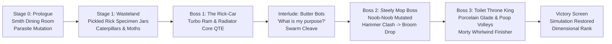
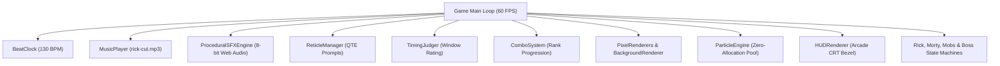

# Rick and Morty: Eternal Nightmare Machine — The Videogame

[](https://github.com/)
[](https://github.com/)
[](https://github.com/)
[](https://github.com/)

A hyper-saturated, 16-bit arcade rhythm-beat-'em-up videogame faithful to Paul Robertson's cult-classic short *Rick and Morty in the Eternal Nightmare Machine* and Brent Busby's master chiptune soundtrack.

---

## 🕹️ Game Overview & Narrative

The simulation has suffered a catastrophic dimensional cascade! What began as a peaceful suburban breakfast in the Smith family dining room is violently invaded by eldritch memory parasites. Rick Sanchez and Morty Smith must battle across the corrupted wasteland, purge cyber-mobs, and conquer three multi-phase boss encounters before the matrix completely collapses into 1-bit Game Boy static.



---

## ⌨️ Controls & Move List

| Action | Key / Input | Character | Description |
| :--- | :--- | :--- | :--- |
| **Move Left / Right** | `A` / `D` or `←` / `→` | Rick / Morty | 8-way arcade movement |
| **Move Up / Down** | `W` / `S` or `↑` / `↓` | Rick / Morty | Vertical depth positioning |
| **Plasma Blaster** | `J` | Rick | 3-burst rapid projectile on rhythm downbeats |
| **Sledgehammer Smash** | `K` | Rick | Heavy overhead strike that staggers bosses and cores |
| **Portal Shield Parry** | `L` or `Shift` | Rick | Absorbs attacks, negates damage, deflects knockback |
| **Overhead Mob Toss** | `Space` | Rick | Grabs stunned enemies and flings them into waves |
| **Morty Slide Tackle** | `↓ + J` | Morty | Low-profile slide that dodges high projectiles and trips mobs |
| **Morty Broom Whirlwind**| `I` | Morty | 360° Noob-Noob Broom spin for massive area purification |

---

## 🎵 Rhythm-Action & Timing Mechanics

The combat engine is synchronised at **130.0 BPM** ($461.54\text{ ms}$ per beat):

* **Concentric Shrinking Reticles:** Outer rings collapse from $R = 64\text{ px}$ to $R = 16\text{ px}$ over exactly 1 beat.
* **Hit Windows & Ratings:**
  * **PERFECT ($\le 35\text{ ms}$):** $+150\%$ damage, $+2$ combo, purges simulation corruption, triggers starburst sparks.
  * **GREAT ($\le 70\text{ ms}$):** $+120\%$ damage, $+1$ combo, normal knockback.
  * **GOOD ($\le 110\text{ ms}$):** $100\%$ damage, sustains combo streak.
  * **MISS ($> 110\text{ ms}$):** $0\%$ damage, drops combo, increases simulation glitch meter.
* **Combo Progression:**
  $$\text{Rank D } (1.0\times) \rightarrow \text{Rank C } (1.2\times) \rightarrow \text{Rank B } (1.5\times) \rightarrow \text{Rank A } (2.0\times) \rightarrow \text{Rank S } (2.5\times) \rightarrow \text{Rank SS } (3.0\times) \rightarrow \text{DIMENSIONAL } (4.0\times)$$

---

## 👾 Enemies & Boss Encounters

1. **Segmented Grub Caterpillar:** Armored worm that writhes across the floor with high-speed ramming bites.
2. **Corrupted Simulation Moth:** Neon aerial insect that swoops from the upper screen on off-beats.
3. **Bio-Suit Plasma Trooper:** Ranged cyber soldier that patrols the midground firing energy rifles.
4. **Butter Bot Legion:** Fast wheeled droid that dashes with twin laser arms.
5. **Boss 1: The Rick-Car Mech:** Turbo ramming attacks with exposed vulnerable radiator core.
6. **Boss 2: Steely Mop Boss (Noob-Noob):** Janitor armor with shockwave mop slams, dropping the Noob-Noob Broom.
7. **Boss 3: The Toilet Throne King (Gloobie):** Golden multi-tier porcelain throne with fecal artillery volleys and flush vortex suction.

---

## 🏗️ Technical Architecture



---

## 🚀 Development & Deployment Runbooks

### 1. Local Development
```bash
cd /home/leo/projects/eternal-nightmare-machine
npm install
npm run dev
```
Open `http://localhost:8095` in your browser.

### 2. Running Unit & Integration Tests
```bash
npm run test
```

### 3. Production Build
```bash
npm run build
```

### 4. Docker Container Deployment
```bash
docker compose up -d --build
```
Verify container status:
```bash
curl -f http://127.0.0.1:8095/health
```
